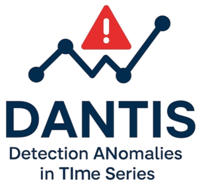
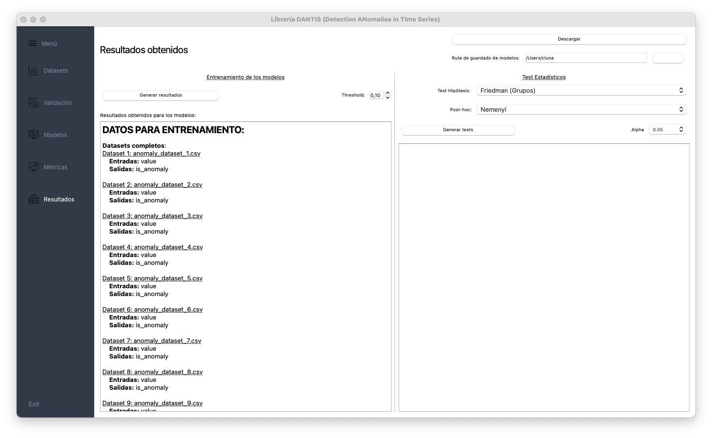

<p align="center">
  
</p>


[](https://pypi.org/project/dantis/)
[](https://github.com/kdis-lab/anomaly_lib/blob/main/LICENSE)
[](https://github.com/psf/black)


--- 

DANTIS brings together **50+ anomaly detection algorithms**—from classical statistical methods and machine learning to deep learning—under a **unified scikit-learn–style API**. It consolidates models from diverse libraries and includes proprietary algorithms developed by our team.


## Installation
```bash
pip install dantis              # From PyPI (recommended)
```

## Quick start
```python
from dantis.machine_learning import DecisionTreeClassifier
from dantis.deep_learning import ALAD
from sklearn.metrics import accuracy_score
import pandas as pd

# Load your time series data
df = pd.read_csv("anomaly_datasets/anomaly_dataset_1.csv")

X = df.drop(columns=["is_anomaly"])
y = df["is_anomaly"]

# Split data chronologically for time series (no shuffling)
split_idx = int(len(df) * 0.8)
X_train, X_test = X.iloc[:split_idx], X.iloc[split_idx:]
y_train, y_test = y.iloc[:split_idx], y.iloc[split_idx:]

decision_tree_model = DecisionTreeClassifier()
decision_tree_model.fit(X_train, y_train)


y_pred = decision_tree_model.predict(X_test)
acc = accuracy_score(y_test, y_pred)
print(f"DecisionTree Accuracy: {acc:.3f}")

alad_model = ALAD()
alad_model.fit(X_train, y_train)

y_pred = alad_model.predict(X_test)
acc = accuracy_score(y_test, y_pred)
print(f"ALAD Accuracy: {acc:.3f}")
```


## Key features

* **Wide algorithm coverage** – 50+ detectors across deep learning, machine learning, and statistical methods.
* **Consistent API** – all detectors follow the scikit-learn `fit/predict` paradigm and expose `decision_scores_`, `predict_proba`, …
* **Pipeline & preprocessing layer** – compose detectors with built-in scalers, transforms, and windowing utilities.
* **Comprehensive evaluation** – metrics and visualisation helpers for rapid benchmarking.
* **Extensibility** – subclass `AlgorithBase` and plug your own model into the ecosystem.

## GUI: Desktop interface for model training & evaluation

DANTIS includes a full-featured graphical interface to simplify the use of the library for users without programming experience. Inspired by tools like **Weka** and **KNIME**, this desktop application enables:

- Training and testing of anomaly detection models
- Preprocessing pipelines and parameter tuning
- Quantitative comparison of models using the [StaTDS](https://github.com/kdis-lab/StaTDS) library

<p align="center">
  
</p>


## Developed in:


## Documentación
Documentation is currently available on [GitHub](https://github.com/kdis-lab/anomaly_lib).

📚 A full documentation site with tutorials and API reference is being developed at **[https://dantis.readthedocs.io](https://dantis.readthedocs.io)**.


## Funding & affiliations

DANTIS has been developed within the research activities of the DaSCI Institute (Andalusian Inter-University Institute in Data Science and Computational Intelligence), by members of the research groups KDISLAB (Knowledge Discovery and Intelligent Systems, University of Córdoba) and SCI2S (Soft Computing and Intelligent Information Systems, University of Granada).

This work has been supported by the following projects:
- TED2021-132702B-C22 - Mantenimiento Predictivo basado en Detección de Anomalías: Framework y Mantenimiento de Camiones de Alto Tonelaje (PREMAD-Truck)

We gratefully acknowledge this support.

<p align="center">
  
  &nbsp;&nbsp;&nbsp;&nbsp;&nbsp;&nbsp;&nbsp;&nbsp;</br>
  
  &nbsp;&nbsp;&nbsp;&nbsp;
  
</p>

### Available algorithms:

#### **Deep Learning**

| Name      | Function                                             |
|-----------|------------------------------------------------------|
| ALAD      | anomaly_lib.deep_learning.alad.ALAD                     |
| AnoGAN    | anomaly_lib.deep_learning.anogan.AnoGAN                 |
| AutoEncoder | anomaly_lib.deep_learning.auto_encoder.AutoEncoder      |
| DeepSVDD  | anomaly_lib.deep_learning.deep_svdd.DeepSVDD            |
| MO_GAAL   | anomaly_lib.deep_learning.mo_gaal.MO_GAAL               |
| SO_GAAL   | anomaly_lib.deep_learning.so_gaal.SO_GAAL               |
| VAE       | anomaly_lib.deep_learning.vae.VAE                       |


#### **Machine Learning**

| Name                          | Function                                                                         |
|-------------------------------|----------------------------------------------------------------------------------|
| DecisionTreeClassifierClassOD | anomaly_lib.machine_learning.decision_tree_classifier.DecisionTreeClassifierClassOD |
| ECOD                          | anomaly_lib.machine_learning.ecod.ECOD                                               |
| IForest                       | anomaly_lib.machine_learning.iforest.IForest                                         |
| KNN                           | anomaly_lib.machine_learning.knn.KNN                                                 |
| LOF                           | anomaly_lib.machine_learning.lof.LOF                                                 |
| MLPClassOD                    | anomaly_lib.machine_learning.mlp_classifier.MLPClassOD                               |
| MultinomialNBClassOD          | anomaly_lib.machine_learning.multinomial_nb.MultinomialNBClassOD                     |
| GaussianNBClassOD             | anomaly_lib.machine_learning.naive_bayes.GaussianNBClassOD                           |
| OCSVM                         | anomaly_lib.machine_learning.ocsvm.OCSVM                                             |
| RandomForestClassOD           | anomaly_lib.machine_learning.random_forest_classifier.RandomForestClassOD             |
| SVMClassOD                    | anomaly_lib.machine_learning.svm.SVMClassOD                                          |

#### **Statistical**

| Name                          | Function                                                                         |
|-------------------------------|----------------------------------------------------------------------------------|
| ABOD                          | anomaly_lib.statistical.abod.ABOD                                                    |
| CBLOF                         | anomaly_lib.statistical.cblof.CBLOF                                                  |
| CD                            | anomaly_lib.statistical.cd.CD                                                        |
| COF                           | anomaly_lib.statistical.cof.COF                                                      |
| LUNAR                         | anomaly_lib.statistical.lunar.LUNAR                                                  |
| COPOD                         | anomaly_lib.statistical.copod.COPOD                                                  |
| FeatureBagging                | anomaly_lib.statistical.feature_bagging.FeatureBagging                               |
| GMM                           | anomaly_lib.statistical.gmm.GMM                                                      |
| HBOS                          | anomaly_lib.statistical.hbos.HBOS                                                    |
| INNE                          | anomaly_lib.statistical.inne.INNE                                                    |
| KDE                           | anomaly_lib.statistical.kde.KDE                                                      |
| KPCA                          | anomaly_lib.statistical.kpca.KPCA                                                    |
| LMDD                          | anomaly_lib.statistical.lmdd.LMDD                                                    |
| LOCI                          | anomaly_lib.statistical.loci.LOCI                                                    |
| LODA                          | anomaly_lib.statistical.loda.LODA                                                    |
| LSCP                          | anomaly_lib.statistical.lscp.LSCP                                                    |
| MAD                           | anomaly_lib.statistical.mad.MAD                                                      |
| MCD                           | anomaly_lib.statistical.mcd.MCD                                                      |
| PCA                           | anomaly_lib.statistical.pca.PCA                                                      |
| QMCD                          | anomaly_lib.statistical.qmcd.QMCD                                                    |
| RGraph                        | anomaly_lib.statistical.rgraph.RGraph                                                |
| ROD                           | anomaly_lib.statistical.rod.ROD                                                      |
| Sampling                      | anomaly_lib.statistical.sampling.Sampling                                            |
| SOD                           | anomaly_lib.statistical.sod.SOD                                                      |
| SOS                           | anomaly_lib.statistical.sos.SOS                                                      |
| XGBOD                         | anomaly_lib.statistical.xgbod.XGBOD                                                  |
| MatrixProfile                 | anomaly_lib.statistical.matrixprofile.MatrixProfile                                  |
| ARIMA                         | anomaly_lib.statistical.arima.ARIMA                                                  |
| SARIMAX                       | anomaly_lib.statistical.sarimax.SARIMAX                                              |
| VARMAX                        | anomaly_lib.statistical.varmax.VARMAX                                                |
| HoltWinters                   | anomaly_lib.statistical.holt_winters.HoltWinters                                    |
| SingleExponentialSmoothing    | anomaly_lib.statistical.singleExponentialSmoothing.SingleExponentialSmoothing        |


## License

`DANTIS` is distributed under the **MIT License**.
See [`LICENSE`](LICENSE) for details.